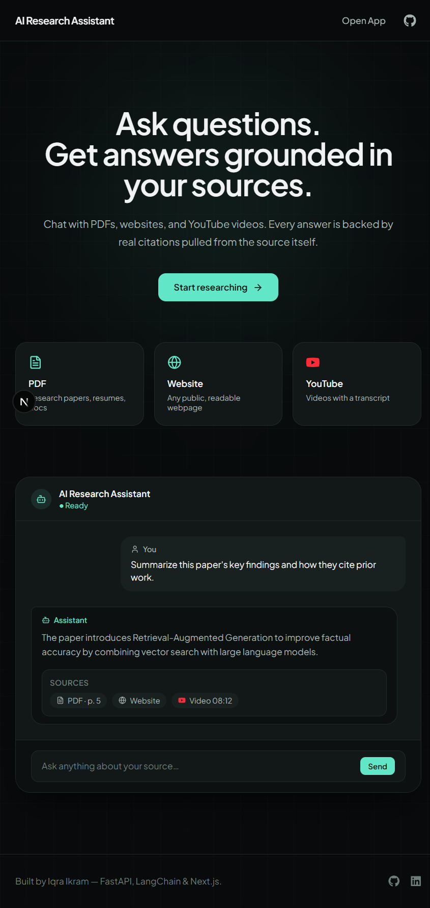
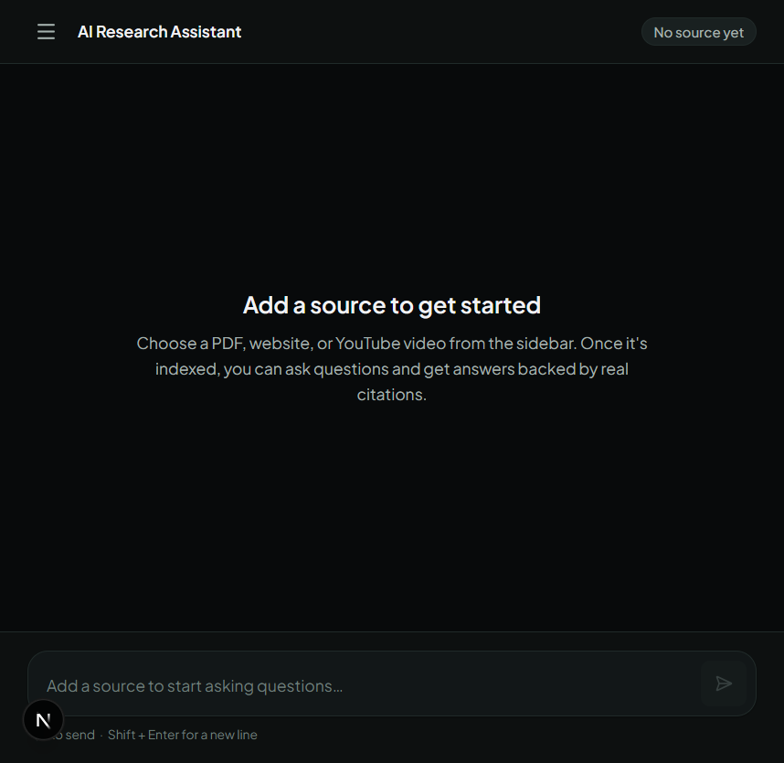
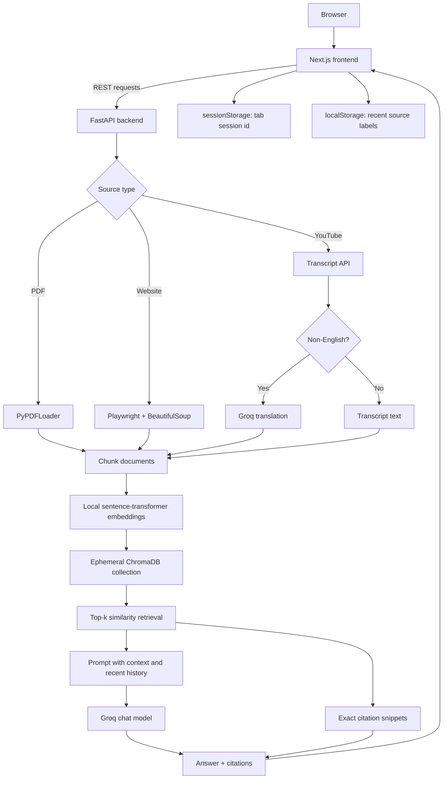

<div align="center">

# Deep Searcher

### Ask questions about PDFs, websites, and YouTube videos, with answers grounded in real citations.

[](https://fastapi.tiangolo.com/)
[](https://nextjs.org/)
[](https://www.typescriptlang.org/)
[](https://www.python.org/)
[](https://www.langchain.com/)
[](https://www.trychroma.com/)

[Quick Start](#quick-start) &bull; [Features](#features) &bull; [Architecture](#architecture) &bull; [Design Philosophy](#design-philosophy) &bull; [Deployment](#deployment) &bull; [Roadmap](#roadmap)

</div>

---

## Screenshots

### Landing page

<p align="center">
  
</p>

### Chat workspace

<p align="center">
  
</p>

## Overview

Most "chat with your PDF" demos hide the retrieval step. This project implements a real **Retrieval-Augmented Generation (RAG)** workflow: one source is extracted, split into chunks, embedded, indexed, retrieved for each question, and returned with the exact passages used as citations.

You can provide a PDF, a public website, or a YouTube video with an available transcript. The frontend displays the answer and expandable citations. There is no login or database: each browser tab gets a random session id and the backend holds its active index in memory.

## Features

| Capability | Details |
| --- | --- |
| PDF chat | Drag-and-drop or file-picker upload. PDFs are streamed, size-checked, parsed, and removed after processing. |
| Website chat | Playwright Chromium renders public pages, including many JavaScript-heavy sites. |
| YouTube chat | Fetches available transcripts and translates non-English transcripts through Groq. |
| Real citations | Returns the same retrieved document chunks supplied to the model. |
| Conversation memory | Sends recent non-error turns with each question, capped by count and characters. |
| Visible AI state | Shows `preparing`, `searching`, `processing`, `generating`, `completed`, and `error` states. |
| Practical UX | Copy answers, retry failures, Enter to send, Shift+Enter for a newline, and mobile sidebar support. |
| Recent sources | Stores source labels in browser `localStorage`; no server history is fabricated. |

## Tech Stack

| Layer | Choice | Why |
| --- | --- | --- |
| Frontend | Next.js 16 App Router + TypeScript | File-based routing, typed UI, and straightforward Node/Vercel deployment. |
| Styling | Tailwind CSS 4 | Local utility styling and reusable UI primitives. |
| Backend | FastAPI | Small, explicit HTTP API with validation and CORS support. |
| Orchestration | LangChain | Connects documents, retriever, prompt, model, and citation output. |
| Vector store | ChromaDB ephemeral client | No database setup for the one-source-per-session scope. |
| Embeddings | `sentence-transformers` with `all-MiniLM-L6-v2` | Runs locally and does not require an embedding API key. |
| Chat model | Groq, default `openai/gpt-oss-20b` | Fast hosted generation with a configurable model name. |
| PDF extraction | PyPDF | Reads text and preserves PDF page metadata for citations. |
| Website extraction | Playwright + BeautifulSoup | Renders pages, removes non-content elements, and extracts readable text. |
| Translation | Groq | Only used when a YouTube transcript is detected as non-English. |

## Architecture



### Project structure

```text
backend/
  main.py              FastAPI app, schemas, routes, CORS, and session store
  rag_pipeline.py      loaders, chunking, embeddings, retrieval, and RAG chain
  youtubeContent.py    transcript fetching and optional translation
  requirements.txt     Python dependencies
  .env.example         safe configuration template
  uploads/             temporary PDF workspace

frontend/
  package.json         scripts and dependencies
  next.config.ts       Next.js configuration
  src/app/page.tsx     landing page
  src/app/chat/page.tsx chat workflow and session state
  src/components/home/ landing page sections
  src/components/chat/ sidebar, composer, messages, citations, and status UI
  src/components/layout/ navigation, container, and footer
  src/components/ui/   reusable design-system controls
  src/lib/api.ts       browser API client
  src/lib/types.ts     shared TypeScript types
  src/lib/validators.ts client-side source validation
```

## Quick Start

### Requirements

- Python 3.11 or newer
- Node.js 20 or newer and npm
- A Groq API key
- Chromium dependencies supported by Playwright

### 1. Start the backend

```bash
cd backend
python -m venv .venv
```

Windows PowerShell:

```powershell
.\.venv\Scripts\Activate.ps1
```

macOS/Linux:

```bash
source .venv/bin/activate
```

Install Python packages and Chromium:

```bash
python -m pip install -r requirements.txt
playwright install chromium
```

Copy the environment template and set your key:

```bash
cp .env.example .env
```

On Windows, use `Copy-Item .env.example .env` if `cp` is unavailable. Edit `backend/.env`, then run:

```bash
uvicorn main:app --reload --host 127.0.0.1 --port 8000
```

The API is available at `http://127.0.0.1:8000`. Confirm it with `GET /health`.

### 2. Start the frontend

In a second terminal:

```bash
cd frontend
npm install
cp .env.example .env.local
npm run dev
```

Open `http://localhost:3000`, select **Start researching**, add a source, and ask a question.

## Environment Variables

### Backend: `backend/.env`

| Variable | Required | Default | Description |
| --- | --- | --- | --- |
| `GROQ_API_KEY` | Yes | None | Chat generation and non-English YouTube translation. |
| `LLM_MODEL` | No | `openai/gpt-oss-20b` | Groq chat model name. |
| `ALLOWED_ORIGINS` | Production yes | `http://localhost:3000` | Comma-separated frontend origins accepted by CORS. |
| `MAX_PDF_SIZE_MB` | No | `20` | Maximum PDF upload size. |
| `MAX_WEBSITE_CHARS` | No | `200000` | Maximum extracted website text. |
| `RETRIEVER_K` | No | `4` | Number of chunks retrieved for a question. |
| `SESSION_TTL_SECONDS` | No | `21600` | Idle session lifetime in seconds. |
| `MAX_SESSIONS` | No | `200` | Maximum in-memory sessions. |
| `MAX_HISTORY_CHARS` | No | `20000` | Conversation history character cap. |
| `DEBUG` | No | `false` | Exposes raw internal errors when true; keep false in production. |

Embeddings run locally, so `HUGGINGFACEHUB_API_TOKEN` is not used by the current implementation. Never put secrets in `.env.example`, frontend variables, source code, or Git history.

### Frontend: `frontend/.env.local`

| Variable | Required | Default | Description |
| --- | --- | --- | --- |
| `NEXT_PUBLIC_API_URL` | Production yes | `http://127.0.0.1:8000` | Public FastAPI URL without a trailing slash. |

`NEXT_PUBLIC_API_URL` is bundled into browser JavaScript and must never contain a secret.

## API Reference

### `GET /health`

Returns `{"status":"ok"}` with HTTP 200. Use this as the service liveness check.

### `POST /process`

Processes a website or YouTube URL.

```json
{
  "userid": "tab-session-id",
  "source": "https://example.com",
  "source_type": "web"
}
```

`source_type` must be `web` or `youtube`. The response includes the indexed source title and type.

### `POST /process-pdf`

Accepts `multipart/form-data` with `userid` and `file`. The filename must end in `.pdf`. The default upload limit is 20 MB.

### `POST /ask`

Asks a question about the active source.

```json
{
  "userid": "tab-session-id",
  "question": "What is the main conclusion?",
  "history": [
    {"role": "user", "content": "Summarize the source."}
  ]
}
```

Success returns an `answer` and `citations`. Each citation contains `id`, `type`, `title`, `source`, `page`, and `snippet`.

### `GET /session/{userid}`

Returns whether the session has an active source and its display metadata.

### `DELETE /session/{userid}`

Removes the active session and returns `{"message":"Session reset"}`.

Validation failures use FastAPI's standard HTTP 422 response. Application errors use a JSON `detail` field. Invalid session ids, missing sources, oversized fields, unavailable transcripts, and processing failures are handled explicitly.

## Design Philosophy

This app deliberately does not pretend to be a persistent research platform. It has one active source per browser session, no accounts, no database, and no server-side research history. The recent-source list is browser-local, and citations are generated from retrieved content rather than decorative labels.

This keeps the product honest and easy to run. A durable multi-user version would require authentication, a database, persistent vector storage, background ingestion jobs, rate limiting, and observability.

### Known constraints

- Restarting or scaling the backend erases active in-memory sessions.
- Multiple backend replicas require sticky sessions or shared state.
- Scanned/image-only PDFs are not supported because OCR is not included.
- YouTube videos require an available transcript.
- Website bot protection, network failures, and long-running pages can cause ingestion errors.
- Groq availability, quotas, and model changes affect response generation.

## Testing

There is currently no automated test suite. Run the available checks before release:

```bash
cd frontend
npm run lint
npm run build

cd ../backend
python -m compileall -q main.py rag_pipeline.py youtubeContent.py
```

Then smoke test `/health`, PDF processing, website processing, YouTube processing, `/ask`, session reset, and production CORS. Include failure cases for invalid URLs, missing transcripts, oversized PDFs, missing API keys, and backend restarts.

## Deployment

Deploy the frontend and backend as separate services.

### Backend deployment

Use a long-lived Python host such as Render, Railway, Fly.io, or a VPS. The service needs Python dependencies and Playwright Chromium:

```bash
pip install -r requirements.txt
playwright install --with-deps chromium
uvicorn main:app --host 0.0.0.0 --port $PORT
```

Set these production values in the host's secret/configuration settings:

```text
GROQ_API_KEY=<real secret>
ALLOWED_ORIGINS=https://your-frontend-domain.example
DEBUG=false
```

Configure the host health check to call `/health`. Use HTTPS for the public API URL.

### Frontend deployment

Vercel or any Node host can run the frontend:

```bash
npm ci
npm run build
npm run start
```

Set `NEXT_PUBLIC_API_URL` to the deployed backend HTTPS URL at build time. After deployment, verify both `/` and `/chat`, then test all three source types.

### Production checklist

- [ ] Rotate any API key that was ever exposed.
- [ ] Set the exact frontend origin in `ALLOWED_ORIGINS`.
- [ ] Set `NEXT_PUBLIC_API_URL` to the backend HTTPS URL.
- [ ] Install Playwright Chromium on the backend host.
- [ ] Keep `DEBUG=false`.
- [ ] Configure `/health` monitoring.
- [ ] Confirm backend request timeouts allow source indexing.
- [ ] Run PDF, website, YouTube, question, citation, and reset smoke tests.
- [ ] Use one backend process unless shared session state is implemented.

## Roadmap

- [ ] Persistent multi-source research sessions
- [ ] User accounts and authentication
- [ ] OCR for scanned PDFs
- [ ] Automated backend and frontend tests
- [ ] Background processing for large sources
- [ ] Rate limiting and usage quotas
- [ ] Swappable embedding and model providers
- [ ] Durable vector storage and multi-replica support

## Contributing

Issues and pull requests are welcome. For larger changes, especially authentication, persistence, or provider changes, open an issue first to align on the design and operational impact.

## License

This project is intended to be released under the [MIT License](LICENSE). Add a root `LICENSE` file before publishing if the repository does not already contain one.

## Author

**Iqra Ikram** - Full Stack Developer

[](https://github.com/iqra-ikram)
[](https://www.linkedin.com/in/iqra-ikram-9660732b4/)
